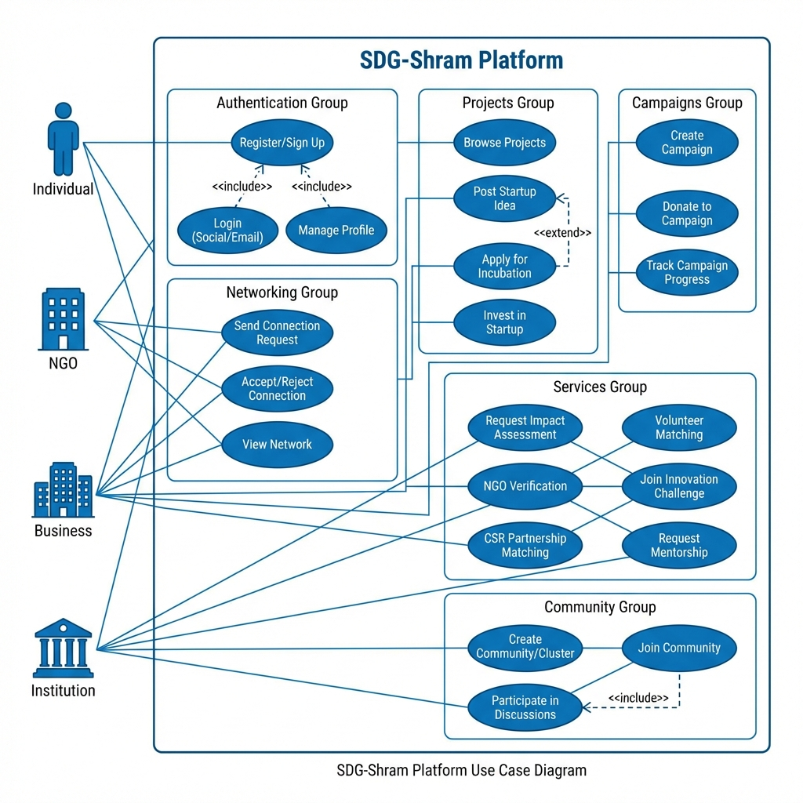

# SDG-Shram: Comprehensive Project Document

<div align="center">


# **SDG-SHRAM**
### *Empowering Collaboration for a Sustainable Future*

**Version:** 1.0  
**Date:** January 2026  
**Document Type:** Project Overview & Specification

---

</div>

## 📋 Table of Contents

1. [Executive Summary](#1-executive-summary)
2. [Vision & Mission](#2-vision--mission)
3. [Problem Statement](#3-problem-statement)
4. [Solution Overview](#4-solution-overview)
5. [Target Beneficiaries](#5-target-beneficiaries)
6. [Use Case Diagram](#6-use-case-diagram)
7. [Detailed Use Cases](#7-detailed-use-cases)
8. [Feature Specifications](#8-feature-specifications)
9. [Impact Assessment](#9-impact-assessment)
10. [Technical Architecture](#10-technical-architecture)
11. [Stakeholder Analysis](#11-stakeholder-analysis)
12. [Business Model](#12-business-model)
13. [Implementation Roadmap](#13-implementation-roadmap)
14. [Risk Analysis](#14-risk-analysis)
15. [Success Metrics](#15-success-metrics)
16. [Conclusion](#16-conclusion)

---

## 1. Executive Summary

**SDG-Shram** is a revolutionary **collaborative social networking platform** designed to accelerate progress toward the **United Nations' 17 Sustainable Development Goals (SDGs)** by connecting diverse stakeholders—businesses, NGOs, academic institutions, and individuals—into a unified ecosystem for sustainable development.

The platform serves as a marketplace for social impact, enabling:
- **Networking** among sustainability-focused organizations and individuals
- **Project collaboration** between funders and implementers
- **Startup incubation** for SDG-aligned innovations
- **Impact measurement** through real-time assessment tools
- **Resource mobilization** through CSR brokerage and volunteer matching

### Key Statistics (Projected Year 1)
| Metric | Target |
|--------|--------|
| Registered Users | 50,000+ |
| Active NGOs | 5,000+ |
| Corporate Partners | 500+ |
| Projects Launched | 1,000+ |
| Total Impact Value | ₹50 Crore+ |

---

## 2. Vision & Mission

### 🌟 Vision Statement

> *"To become the world's leading digital platform that catalyzes global collaboration for achieving the Sustainable Development Goals, creating a future where every individual, organization, and institution can contribute meaningfully to sustainable development."*

### 🎯 Mission Statement

> *"To build an inclusive, transparent, and technology-driven ecosystem that connects changemakers across sectors—businesses, NGOs, institutions, and individuals—enabling them to collaborate, innovate, and create measurable impact on the 17 Sustainable Development Goals."*

### Core Values

| Value | Description |
|-------|-------------|
| **Collaboration** | Fostering partnerships across sectors for collective impact |
| **Transparency** | Ensuring accountability through verified credentials and impact tracking |
| **Innovation** | Encouraging creative solutions to global sustainability challenges |
| **Inclusivity** | Providing equal opportunities for all stakeholders regardless of size |
| **Sustainability** | Promoting long-term environmental, social, and economic balance |
| **Empowerment** | Enabling grassroots changemakers with resources and visibility |

---

## 3. Problem Statement

### 3.1 Global Context

The United Nations adopted the **2030 Agenda for Sustainable Development** with 17 SDGs addressing critical global challenges. However, progress has been slow due to:

- **Fragmented efforts** across sectors
- **Lack of coordination** between stakeholders
- **Insufficient funding** reaching grassroots initiatives
- **Limited visibility** for impactful projects
- **Absence of standardized impact measurement**

### 3.2 Specific Challenges

#### For NGOs
| Challenge | Impact |
|-----------|--------|
| Limited access to funding | Projects remain unimplemented |
| Lack of visibility | Difficult to attract donors/volunteers |
| Complex verification processes | Loss of credibility and partnerships |
| Inadequate volunteer networks | Resource constraints |

#### For Businesses (CSR)
| Challenge | Impact |
|-----------|--------|
| Finding verified NGOs | Risk of fund misuse |
| Measuring CSR impact | Compliance and reporting difficulties |
| Identifying relevant projects | Misaligned investments |
| Tracking fund utilization | Lack of accountability |

#### For Institutions
| Challenge | Impact |
|-----------|--------|
| Connecting research with practice | Knowledge-action gap |
| Student engagement in SDGs | Lost learning opportunities |
| Industry-academia collaboration | Limited innovation transfer |

#### For Individuals
| Challenge | Impact |
|-----------|--------|
| Finding volunteer opportunities | Untapped potential |
| Verifying legitimate causes | Fear of fraud |
| Tracking personal impact | Lack of motivation |

---

## 4. Solution Overview

### 4.1 Platform Concept

SDG-Shram is a **multi-stakeholder digital platform** that creates a:

```
┌─────────────────────────────────────────────────────────────────┐
│                        SDG-SHRAM ECOSYSTEM                       │
├─────────────────────────────────────────────────────────────────┤
│                                                                  │
│   ┌─────────┐    ┌─────────┐    ┌─────────┐    ┌─────────┐     │
│   │  NGOs   │◄──►│Business │◄──►│Institut.│◄──►│Individ. │     │
│   └────┬────┘    └────┬────┘    └────┬────┘    └────┬────┘     │
│        │              │              │              │           │
│        └──────────────┼──────────────┼──────────────┘           │
│                       ▼                                          │
│              ┌────────────────┐                                  │
│              │   SDG-Shram    │                                  │
│              │    Platform    │                                  │
│              └───────┬────────┘                                  │
│                      │                                           │
│    ┌─────────────────┼─────────────────┐                        │
│    ▼                 ▼                 ▼                        │
│ ┌──────┐       ┌──────────┐      ┌──────────┐                  │
│ │Connect│      │ Projects │      │ Services │                  │
│ └──────┘       └──────────┘      └──────────┘                  │
│                                                                  │
└─────────────────────────────────────────────────────────────────┘
```

### 4.2 Core Solution Components

| Component | Function | Value Proposition |
|-----------|----------|-------------------|
| **Networking Hub** | Connect stakeholders | Build SDG-focused professional networks |
| **Project Marketplace** | List and discover projects | Match funders with implementers |
| **Startup Incubator** | Showcase SDG innovations | Attract investment and mentorship |
| **Services Portal** | Request professional services | Access impact assessment, verification, CSR matching |
| **Impact Dashboard** | Track and report impact | Real-time metrics and reporting |
| **Community Clusters** | Topic-focused groups | Knowledge sharing and collaboration |

---

## 5. Target Beneficiaries

### 5.1 Primary Beneficiaries

#### 🏢 Businesses / Corporates
**Who:** Companies with CSR mandates (Section 135, Companies Act 2013)

| Benefit | Description |
|---------|-------------|
| Verified NGO Access | Find compliance-ready NGO partners |
| Impact Reporting | Automated CSR impact reports |
| Project Discovery | SDG-aligned project recommendations |
| Fund Tracking | End-to-end fund utilization visibility |

**Expected Users:** 500+ in Year 1

---

#### 🏛️ NGOs / Non-Profits
**Who:** Registered charitable organizations, grassroots initiatives, social enterprises

| Benefit | Description |
|---------|-------------|
| Visibility | Showcase work to potential funders |
| Verification | Build credibility with 12A/80G/CSR-1 tracking |
| Volunteer Access | Skills-matched volunteer recruitment |
| Funding Opportunities | CSR partnership connections |
| Capacity Building | Access to mentorship and resources |

**Expected Users:** 5,000+ in Year 1

---

#### 🎓 Academic Institutions
**Who:** Universities, research centers, schools, training institutes

| Benefit | Description |
|---------|-------------|
| Research Collaboration | Partner with NGOs/businesses on SDG research |
| Student Engagement | Connect students with real-world SDG projects |
| Innovation Challenges | Host hackathons and challenges |
| Internship Pipeline | Facilitate SDG-focused internships |

**Expected Users:** 200+ in Year 1

---

#### 👤 Individuals
**Who:** Students, professionals, retirees, volunteers, donors

| Benefit | Description |
|---------|-------------|
| Volunteering | Find skills-matched opportunities |
| Donation | Contribute to verified causes |
| Networking | Connect with sustainability professionals |
| Learning | Participate in SDG events and challenges |
| Entrepreneurship | Launch SDG-aligned startups |

**Expected Users:** 40,000+ in Year 1

---

### 5.2 Secondary Beneficiaries

| Beneficiary | Impact |
|-------------|--------|
| **Local Communities** | Improved access to services (health, education, sanitation) |
| **Environment** | Climate action through coordinated projects |
| **Government** | Accelerated SDG achievement |
| **Economy** | Job creation through social enterprises |
| **Future Generations** | Sustainable development legacy |

---

### 5.3 Beneficiary Ecosystem Map

```
                           ┌───────────────────┐
                           │   UNITED NATIONS  │
                           │   SDG Framework   │
                           └─────────┬─────────┘
                                     │
              ┌──────────────────────┼──────────────────────┐
              │                      │                      │
              ▼                      ▼                      ▼
      ┌───────────────┐     ┌───────────────┐     ┌───────────────┐
      │  GOVERNMENT   │     │   SDG-SHRAM   │     │   INVESTORS   │
      │  (Policy)     │◄───►│   (Platform)  │◄───►│   (Funding)   │
      └───────────────┘     └───────┬───────┘     └───────────────┘
                                    │
         ┌──────────────────────────┼──────────────────────────┐
         │              │           │           │              │
         ▼              ▼           ▼           ▼              ▼
   ┌──────────┐  ┌──────────┐ ┌──────────┐ ┌──────────┐ ┌──────────┐
   │ BUSINESS │  │   NGOs   │ │INSTITUTI.│ │INDIVIDU. │ │ STARTUPS │
   │          │  │          │ │          │ │          │ │          │
   └────┬─────┘  └────┬─────┘ └────┬─────┘ └────┬─────┘ └────┬─────┘
        │             │            │            │            │
        └─────────────┴────────────┼────────────┴────────────┘
                                   │
                                   ▼
                          ┌───────────────┐
                          │  COMMUNITIES  │
                          │ (End Impact)  │
                          └───────────────┘
```

---

## 6. Use Case Diagram

### 6.1 System Use Case Diagram



### 6.2 Use Case Summary Table

| Actor | Primary Use Cases |
|-------|-------------------|
| **Individual** | Register, Login, Manage Profile, Connect, Volunteer, Donate, Join Challenges |
| **NGO** | Register, Create Campaigns, Verify Credentials, Request CSR Partners, Recruit Volunteers |
| **Business** | Register, Browse NGOs, Fund Projects, Request Impact Assessment, Track CSR |
| **Institution** | Register, Post Research Projects, Host Challenges, Connect Students |
| **Admin** | Verify NGOs, Manage Users, Monitor Platform, Generate Reports |

---

## 7. Detailed Use Cases

### UC-01: User Registration

| Field | Description |
|-------|-------------|
| **Use Case ID** | UC-01 |
| **Name** | User Registration |
| **Actors** | Individual, NGO, Business, Institution |
| **Description** | Register on the platform with stakeholder-specific information |
| **Preconditions** | User has valid email and/or social account |
| **Postconditions** | User account created and profile initialized |

**Flow:**
1. User selects stakeholder type
2. User provides required information:
   - Individual: Name, Email, Skills, SDG Interests
   - NGO: Organization Name, Registration Number, Domain, 12A/80G Status
   - Business: Company Name, GSTIN, CSR Focus Areas
   - Institution: Institution Name, Type, Research Areas
3. User agrees to Terms of Service
4. System validates and creates account
5. Confirmation email sent

---

### UC-02: Create Campaign (NGO)

| Field | Description |
|-------|-------------|
| **Use Case ID** | UC-02 |
| **Name** | Create Fundraising Campaign |
| **Actors** | NGO |
| **Description** | NGO creates a campaign to raise funds for a specific project |
| **Preconditions** | NGO is verified and logged in |
| **Postconditions** | Campaign is live and visible to donors |

**Flow:**
1. NGO navigates to "Create Campaign"
2. Fills campaign details (Title, Description, Goal, SDGs, Duration)
3. Uploads supporting documents and images
4. Submits for review
5. Admin approves campaign
6. Campaign goes live

---

### UC-03: CSR Partnership Matching

| Field | Description |
|-------|-------------|
| **Use Case ID** | UC-03 |
| **Name** | CSR Partnership Matching |
| **Actors** | Business, NGO |
| **Description** | Platform matches businesses with suitable NGO partners |
| **Preconditions** | Business has defined CSR preferences; NGO is verified |
| **Postconditions** | Partnership initiated between matched entities |

**Flow:**
1. Business defines CSR budget and SDG focus areas
2. System recommends matching NGOs based on:
   - SDG alignment
   - Geographic preference
   - Trust score
   - Past performance
3. Business reviews NGO profiles
4. Business sends partnership request
5. NGO accepts/negotiates terms
6. Partnership formalized

---

### UC-04: Volunteer Matching

| Field | Description |
|-------|-------------|
| **Use Case ID** | UC-04 |
| **Name** | Volunteer Skills Matching |
| **Actors** | Individual, NGO |
| **Description** | Match volunteers with opportunities based on skills |
| **Preconditions** | Individual has completed skills profile; NGO has open positions |
| **Postconditions** | Volunteer assigned to opportunity |

**Flow:**
1. Individual updates skills and availability
2. NGO posts volunteer requirements
3. Algorithm matches based on:
   - Skills compatibility
   - Location
   - Time availability
   - SDG interests
4. Matched opportunities shown to individual
5. Individual applies
6. NGO reviews and accepts

---

### UC-05: Impact Assessment

| Field | Description |
|-------|-------------|
| **Use Case ID** | UC-05 |
| **Name** | Request Impact Assessment |
| **Actors** | NGO, Business |
| **Description** | Request professional assessment of project/organization impact |
| **Preconditions** | Organization is registered; Project has documented activities |
| **Postconditions** | Impact report generated and shared |

**Flow:**
1. Organization requests impact assessment
2. Selects assessment type (Project, Organization, SDG-specific)
3. Submits relevant documentation
4. Assessment engine processes data
5. Report generated with:
   - Beneficiary metrics
   - SDG contribution scores
   - Environmental impact
   - Economic value created
6. Report delivered and shared

---

### UC-06: Post Startup Idea

| Field | Description |
|-------|-------------|
| **Use Case ID** | UC-06 |
| **Name** | Post SDG-Aligned Startup |
| **Actors** | Individual, Institution |
| **Description** | Submit a startup idea for visibility and potential investment |
| **Preconditions** | User is logged in |
| **Postconditions** | Startup listed in the marketplace |

**Flow:**
1. User navigates to "Post Startup Project"
2. Fills startup details:
   - Name, Description, Stage
   - SDG Goals addressed
   - Funding requirements
   - Team information
3. Uploads pitch deck/documents
4. Submits for listing
5. Startup appears in "Explore Startups"
6. Investors/mentors can view and connect

---

## 8. Feature Specifications

### 8.1 Feature Matrix

| Module | Feature | Individual | NGO | Business | Institution |
|--------|---------|------------|-----|----------|-------------|
| **Auth** | Email Registration | ✓ | ✓ | ✓ | ✓ |
| **Auth** | Social Login (Google/X) | ✓ | ✓ | ✓ | ✓ |
| **Profile** | Detailed Profile | ✓ | ✓ | ✓ | ✓ |
| **Network** | Send Connections | ✓ | ✓ | ✓ | ✓ |
| **Network** | View Network | ✓ | ✓ | ✓ | ✓ |
| **Feed** | Post Updates | ✓ | ✓ | ✓ | ✓ |
| **Campaigns** | Create Campaign | ✗ | ✓ | ✗ | ✗ |
| **Campaigns** | Donate | ✓ | ✗ | ✓ | ✓ |
| **Projects** | Post Startup | ✓ | ✓ | ✓ | ✓ |
| **Projects** | Invest in Startup | ✗ | ✗ | ✓ | ✓ |
| **Services** | Impact Assessment | ✗ | ✓ | ✓ | ✓ |
| **Services** | NGO Verification | ✗ | ✓ | ✗ | ✗ |
| **Services** | CSR Matching | ✗ | ✓ | ✓ | ✗ |
| **Services** | Volunteer Matching | ✓ | ✓ | ✗ | ✓ |
| **Services** | Mentorship | ✓ | ✗ | ✗ | ✓ |
| **Community** | Create Cluster | ✓ | ✓ | ✓ | ✓ |
| **Community** | Join Cluster | ✓ | ✓ | ✓ | ✓ |

### 8.2 Service Modules Deep Dive

#### 📊 Impact Assessment Service

```
┌─────────────────────────────────────────────────────────────┐
│                    IMPACT ASSESSMENT ENGINE                  │
├─────────────────────────────────────────────────────────────┤
│                                                              │
│  INPUT                    PROCESSING              OUTPUT     │
│  ─────                    ──────────              ──────     │
│                                                              │
│  • Project Data     ──►  • SDG Mapping      ──►  • Impact    │
│  • Beneficiary Info      • Metric Analysis       Report      │
│  • Financial Data        • Benchmark Compare   • SDG Score   │
│  • Activity Logs         • AI Scoring          • Recommend.  │
│                                                              │
└─────────────────────────────────────────────────────────────┘
```

**Metrics Tracked:**
- Total beneficiaries reached
- CO2 offset (environmental projects)
- Jobs created
- Students educated
- Healthcare access provided
- Clean water delivered
- Gender equality indicators

---

#### ✅ NGO Verification Service

**Verification Levels:**

| Tier | Requirements | Benefits |
|------|--------------|----------|
| **Basic** | Email verified, Profile complete | Listed on platform |
| **Tier 1** | 12A Certificate verified | Access to individual donors |
| **Tier 2** | 12A + 80G verified | Tax-exempt donations |
| **Tier 3** | 12A + 80G + CSR-1 | Corporate CSR partnerships |

**Trust Score Algorithm:**
- Document verification: 30%
- Past project completion: 25%
- User reviews: 20%
- Financial transparency: 15%
- Platform engagement: 10%

---

#### 🤝 CSR Brokerage Service

**Matching Criteria:**

| Factor | Weight |
|--------|--------|
| SDG Alignment | 30% |
| Geographic Match | 20% |
| Budget Compatibility | 20% |
| NGO Trust Score | 15% |
| Past Performance | 15% |

---

## 9. Impact Assessment

### 9.1 Social Impact

| Impact Area | Expected Outcome (Year 1) |
|-------------|---------------------------|
| **Employment** | 500+ jobs created through platform startups |
| **Education** | 10,000+ students engaged in SDG learning |
| **Healthcare** | 50,000+ beneficiaries through health campaigns |
| **Environment** | 100,000 trees planted through climate projects |
| **Women Empowerment** | 5,000+ women trained/employed |
| **Water & Sanitation** | 20,000+ gaining clean water access |

### 9.2 Economic Impact

| Metric | Value (Year 1) |
|--------|----------------|
| Total funds mobilized | ₹50 Crore |
| CSR funds channelized | ₹30 Crore |
| Startup investments | ₹15 Crore |
| Economic value created | ₹200 Crore (multiplier effect) |

### 9.3 SDG Contribution Matrix

| SDG | Platform Contribution |
|-----|----------------------|
| SDG 1: No Poverty | Livelihood programs, microfinance connections |
| SDG 2: Zero Hunger | Food security campaigns, agri-startups |
| SDG 3: Good Health | Health campaigns, telemedicine startups |
| SDG 4: Quality Education | EdTech startups, volunteer teaching |
| SDG 5: Gender Equality | Women empowerment projects, training |
| SDG 6: Clean Water | Water projects, sanitation campaigns |
| SDG 7: Clean Energy | Renewable energy startups, solar projects |
| SDG 8: Decent Work | Job creation, skill development |
| SDG 9: Industry & Innovation | Startup incubation, tech solutions |
| SDG 10: Reduced Inequalities | Inclusive programs, accessibility |
| SDG 11: Sustainable Cities | Urban development, smart city startups |
| SDG 12: Responsible Consumption | Recycling initiatives, waste startups |
| SDG 13: Climate Action | Environmental projects, carbon offset |
| SDG 14: Life Below Water | Marine conservation, ocean cleanup |
| SDG 15: Life on Land | Afforestation, wildlife protection |
| SDG 16: Peace & Justice | Governance initiatives, transparency |
| SDG 17: Partnerships | Cross-sector collaboration (core feature) |

### 9.4 Impact Measurement Framework

```
┌─────────────────────────────────────────────────────────────────┐
│                    IMPACT MEASUREMENT FRAMEWORK                  │
├─────────────────────────────────────────────────────────────────┤
│                                                                  │
│  INPUTS              ACTIVITIES           OUTPUTS    OUTCOMES   │
│  ──────              ──────────           ───────    ────────   │
│                                                                  │
│  • Funding     ──►   • Projects     ──►   • People   • SDG      │
│  • Volunteers        • Campaigns          • Trees    Progress   │
│  • Resources         • Startups           • Jobs     • Lives    │
│  • Technology        • Services           • Water    Improved   │
│                                           • Energy              │
│                                                                  │
│                    IMPACT = f(Outputs × Quality × Sustainability)│
│                                                                  │
└─────────────────────────────────────────────────────────────────┘
```

---

## 10. Technical Architecture

### 10.1 System Architecture

```
┌─────────────────────────────────────────────────────────────────┐
│                         CLIENT LAYER                             │
│  ┌─────────────┐  ┌─────────────┐  ┌─────────────┐              │
│  │ Web Browser │  │ Mobile Web  │  │   PWA       │              │
│  └──────┬──────┘  └──────┬──────┘  └──────┬──────┘              │
│         └────────────────┼────────────────┘                      │
└─────────────────────────┬───────────────────────────────────────┘
                          │ HTTPS
┌─────────────────────────┴───────────────────────────────────────┐
│                      APPLICATION LAYER                           │
│  ┌──────────────────────────────────────────────────────────┐   │
│  │                    Express.js Server                      │   │
│  │  ┌─────────┐ ┌─────────┐ ┌─────────┐ ┌─────────┐        │   │
│  │  │  Auth   │ │Campaign │ │ User    │ │ Service │        │   │
│  │  │ Routes  │ │ Routes  │ │ Routes  │ │ Routes  │        │   │
│  │  └─────────┘ └─────────┘ └─────────┘ └─────────┘        │   │
│  └──────────────────────────────────────────────────────────┘   │
└─────────────────────────┬───────────────────────────────────────┘
                          │
┌─────────────────────────┴───────────────────────────────────────┐
│                        DATA LAYER                                │
│  ┌──────────────────┐  ┌──────────────────┐                     │
│  │    MongoDB       │  │   File Storage   │                     │
│  │  (User, Campaign,│  │ (Images, Docs)   │                     │
│  │   Community...)  │  │                  │                     │
│  └──────────────────┘  └──────────────────┘                     │
└─────────────────────────────────────────────────────────────────┘
```

### 10.2 Technology Stack

| Layer | Technology | Purpose |
|-------|------------|---------|
| **Frontend** | HTML5, CSS3, JavaScript | User interface |
| **Styling** | Vanilla CSS, Custom Design System | Premium aesthetics |
| **Backend** | Node.js, Express.js | Server-side logic |
| **Database** | MongoDB (Mongoose ODM) | Data persistence |
| **Authentication** | JWT (JSON Web Tokens) | Secure auth |
| **Deployment** | Vercel | Serverless hosting |
| **PWA** | Service Workers | Offline capability |

### 10.3 Database Schema Overview

```
┌─────────────┐     ┌─────────────┐     ┌─────────────┐
│    USER     │     │  CAMPAIGN   │     │  COMMUNITY  │
├─────────────┤     ├─────────────┤     ├─────────────┤
│ _id         │     │ _id         │     │ _id         │
│ email       │────►│ creator     │     │ name        │
│ password    │     │ title       │     │ description │
│ stakeholder │     │ description │     │ sdgFocus    │
│ type        │     │ goal        │     │ members[]   │
│ individual{}│     │ sdgGoals[]  │     │ createdBy   │
│ ngo{}       │     │ donations[] │     └─────────────┘
│ business{}  │     │ status      │
│ institution{}│    └─────────────┘
│ connections[]│
│ createdAt   │     ┌─────────────┐     ┌─────────────┐
└─────────────┘     │ CONNECTION  │     │SERVICE_REQ  │
                    ├─────────────┤     ├─────────────┤
                    │ requester   │     │ user        │
                    │ recipient   │     │ serviceType │
                    │ status      │     │ status      │
                    │ createdAt   │     │ details     │
                    └─────────────┘     └─────────────┘
```

---

## 11. Stakeholder Analysis

### 11.1 Stakeholder Map

| Stakeholder | Interest | Influence | Strategy |
|-------------|----------|-----------|----------|
| **NGOs** | High | High | Key partners - prioritize needs |
| **Businesses** | High | High | Revenue source - ensure value |
| **Individuals** | High | Medium | User base - focus on engagement |
| **Institutions** | Medium | Medium | Knowledge partners |
| **Government** | High | High | Alignment with national SDG goals |
| **Investors** | High | High | Platform growth funding |
| **Media** | Medium | Medium | Visibility and promotion |

### 11.2 Value Proposition by Stakeholder

| Stakeholder | Value Proposition |
|-------------|-------------------|
| **NGOs** | "Get verified, get funded, get volunteers, and measure your impact—all in one platform." |
| **Businesses** | "Find verified NGOs, track CSR impact, and meet compliance goals effortlessly." |
| **Individuals** | "Volunteer, donate, or start your own SDG venture with a community of changemakers." |
| **Institutions** | "Connect students and research with real-world SDG projects and innovation challenges." |

---

## 12. Business Model

### 12.1 Revenue Streams

| Revenue Stream | Description | Projected Year 1 |
|----------------|-------------|------------------|
| **Freemium Subscriptions** | Premium features for organizations | ₹50 Lakh |
| **CSR Brokerage Fee** | 2-5% of matched CSR funds | ₹60 Lakh |
| **Verification Services** | Fee for NGO verification | ₹20 Lakh |
| **Impact Reports** | Premium assessment reports | ₹15 Lakh |
| **Corporate Partnerships** | Sponsored challenges, visibility | ₹30 Lakh |
| **Advertising** | Promoted listings | ₹10 Lakh |

**Total Projected Revenue (Year 1):** ₹1.85 Crore

### 12.2 Pricing Tiers

| Tier | Price | Features |
|------|-------|----------|
| **Free** | ₹0 | Basic profile, networking, browse projects |
| **Pro (NGO)** | ₹999/month | Verification support, campaign analytics, priority matching |
| **Enterprise (Business)** | ₹4,999/month | CSR dashboard, impact reports, dedicated support |
| **Institution** | ₹2,499/month | Challenge hosting, student engagement tools |

---

## 13. Implementation Roadmap

### 13.1 Phase Timeline

```
         Q1 2026           Q2 2026           Q3 2026           Q4 2026
    ────────────────  ────────────────  ────────────────  ────────────────
    │   PHASE 1    │  │   PHASE 2    │  │   PHASE 3    │  │   PHASE 4    │
    │    MVP       │  │   GROWTH     │  │   SCALE      │  │  EXPANSION   │
    ├──────────────┤  ├──────────────┤  ├──────────────┤  ├──────────────┤
    │ • Core Auth  │  │ • Campaigns  │  │ • Impact API │  │ • Mobile App │
    │ • Profiles   │  │ • Services   │  │ • AI Matching│  │ • Regional   │
    │ • Networking │  │ • CSR Module │  │ • Payments   │  │   Expansion  │
    │ • Basic UI   │  │ • Startup    │  │ • Analytics  │  │ • API Access │
    │              │  │   Portal     │  │              │  │              │
    └──────────────┘  └──────────────┘  └──────────────┘  └──────────────┘
```

### 13.2 Detailed Milestones

| Phase | Duration | Key Deliverables |
|-------|----------|------------------|
| **Phase 1: MVP** | Jan-Mar 2026 | Core platform with auth, profiles, networking |
| **Phase 2: Growth** | Apr-Jun 2026 | Campaigns, services, startup portal |
| **Phase 3: Scale** | Jul-Sep 2026 | Advanced matching, payments, analytics |
| **Phase 4: Expansion** | Oct-Dec 2026 | Mobile app, regional expansion, API |

---

## 14. Risk Analysis

### 14.1 Risk Matrix

| Risk | Probability | Impact | Mitigation |
|------|-------------|--------|------------|
| **Low User Adoption** | Medium | High | Marketing, partnerships, value demonstration |
| **NGO Fraud** | Low | High | Robust verification, monitoring, user reports |
| **Data Security Breach** | Low | High | Encryption, security audits, compliance |
| **Competition** | Medium | Medium | Differentiation, continuous innovation |
| **Funding Shortage** | Medium | High | Diverse revenue streams, investor relations |
| **Regulatory Changes** | Low | Medium | Legal monitoring, adaptable architecture |
| **Technical Failures** | Low | Medium | Redundancy, monitoring, backup systems |

### 14.2 Risk Response Strategies

| Strategy | Approach |
|----------|----------|
| **Avoid** | Strong verification to prevent fraud |
| **Mitigate** | Security measures, regular audits |
| **Transfer** | Insurance, legal agreements |
| **Accept** | Minor UI changes based on user feedback |

---

## 15. Success Metrics

### 15.1 Key Performance Indicators (KPIs)

| Category | KPI | Target (Year 1) |
|----------|-----|-----------------|
| **Acquisition** | Total registered users | 50,000 |
| **Acquisition** | Active NGOs | 5,000 |
| **Acquisition** | Corporate partners | 500 |
| **Engagement** | Monthly active users | 15,000 |
| **Engagement** | Avg. connections per user | 25 |
| **Engagement** | Campaign engagement rate | 15% |
| **Impact** | Funds mobilized | ₹50 Crore |
| **Impact** | Projects completed | 500 |
| **Impact** | Beneficiaries reached | 500,000 |
| **Revenue** | Total revenue | ₹1.85 Crore |
| **Revenue** | Paying customers | 2,000 |
| **Satisfaction** | Net Promoter Score (NPS) | 50+ |

### 15.2 Impact Dashboard Metrics

```
┌─────────────────────────────────────────────────────────────────┐
│                     IMPACT DASHBOARD                             │
├─────────────────────────────────────────────────────────────────┤
│                                                                  │
│  ┌─────────────┐  ┌─────────────┐  ┌─────────────┐              │
│  │ BENEFICIARY │  │    FUNDS    │  │   PROJECTS  │              │
│  │   500,000   │  │   ₹50 Cr    │  │     500     │              │
│  │   Reached   │  │  Mobilized  │  │  Completed  │              │
│  └─────────────┘  └─────────────┘  └─────────────┘              │
│                                                                  │
│  ┌─────────────┐  ┌─────────────┐  ┌─────────────┐              │
│  │  VOLUNTEERS │  │   STARTUPS  │  │ SDG GOALS   │              │
│  │   10,000    │  │     100     │  │   17/17     │              │
│  │   Matched   │  │  Incubated  │  │  Addressed  │              │
│  └─────────────┘  └─────────────┘  └─────────────┘              │
│                                                                  │
└─────────────────────────────────────────────────────────────────┘
```

---

## 16. Conclusion

### 16.1 Summary

**SDG-Shram** represents a transformative approach to achieving the Sustainable Development Goals by:

1. **Connecting** diverse stakeholders in a unified digital ecosystem
2. **Enabling** transparent and verified collaboration
3. **Accelerating** social impact through technology
4. **Measuring** and reporting real-world outcomes
5. **Scaling** successful initiatives through replication

### 16.2 Call to Action

| Stakeholder | Action |
|-------------|--------|
| **NGOs** | Register, get verified, and access funding opportunities |
| **Businesses** | Partner for CSR, track impact, and meet compliance |
| **Institutions** | Engage students, host challenges, and collaborate on research |
| **Individuals** | Join, volunteer, donate, and start your SDG journey |
| **Investors** | Support the platform to scale social impact |

### 16.3 Contact Information

| Channel | Details |
|---------|---------|
| **Email** | sdg.shram@gmail.com |
| **Phone** | +91 9529068143 |
| **Instagram** | @sdg-shram_1004 |
| **Website** | [SDG-Shram Platform](http://localhost:5000) |

---

<div align="center">

## *"Together, we can build a sustainable future."*

### 🌍 SDG-Shram: Empowering Collaboration for a Sustainable Future 🌍

---

**Document prepared by:** SDG-Shram Development Team  
**Last Updated:** January 2026  
**Version:** 1.0

</div>

---

## Appendix A: Glossary

| Term | Definition |
|------|------------|
| **SDG** | Sustainable Development Goals - 17 global goals adopted by UN |
| **CSR** | Corporate Social Responsibility |
| **12A** | Tax exemption certificate for NGOs in India |
| **80G** | Certificate allowing donors to claim tax deduction |
| **CSR-1** | Registration for NGOs to receive CSR funds |
| **NGO** | Non-Governmental Organization |
| **PWA** | Progressive Web Application |
| **JWT** | JSON Web Token for authentication |

---

## Appendix B: SDG Reference

| SDG | Name | Color Code |
|-----|------|------------|
| 1 | No Poverty | #E5243B |
| 2 | Zero Hunger | #DDA63A |
| 3 | Good Health & Well-being | #4C9F38 |
| 4 | Quality Education | #C5192D |
| 5 | Gender Equality | #FF3A21 |
| 6 | Clean Water & Sanitation | #26BDE2 |
| 7 | Affordable & Clean Energy | #FCC30B |
| 8 | Decent Work & Economic Growth | #A21942 |
| 9 | Industry, Innovation & Infrastructure | #FD6925 |
| 10 | Reduced Inequalities | #DD1367 |
| 11 | Sustainable Cities & Communities | #FD9D24 |
| 12 | Responsible Consumption & Production | #BF8B2E |
| 13 | Climate Action | #3F7E44 |
| 14 | Life Below Water | #0A97D9 |
| 15 | Life on Land | #56C02B |
| 16 | Peace, Justice & Strong Institutions | #00689D |
| 17 | Partnerships for the Goals | #19486A |
